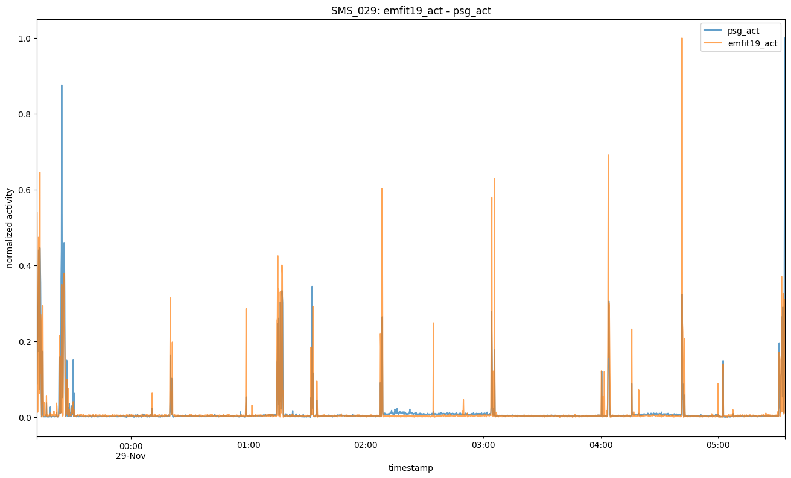

# 💼 Portfolio  

## Analysing Data from Wearable and Nearable Sensors  
**Goal:** Compare the performance of wearable (Empatica E4) and nearable (Emfit QS) sensors against EMG signals from polysomnography (PSG) to assess their reliability in detecting motor activity during sleep.  
📌 **Tech Used:** Python, NumPy, Pandas, Matplotlib, Seaborn, MNE  
📌 **Outcome:** reprocessed and aligned sensor data, performed cross-correlation analysis, and visualized the relationship between wearable/nearable sensors and PSG signals, providing insights into sensor reliability for motor activity detection.  
🔗 [View on GitHub](https://github.com/portmannh/data-analysis-biosensors)  
🔗 [PDF Report](assets/pdfs/Comparing Wearable and Nearable Sensors Versus Polysomnography for Sleep Motor Activity Detection.pdf)  

---

## Community Detection in Bipartite Movie Networks  
**Goal:** Implemented a bipartite network analysis on Letterboxd user-movie data.  
📌 **Tech Used:** NetworkX, Python, Numpy  
📌 **Outcome:** Implemented bilouvain algorithm and visualized found communities of users and movies    
🔗 [View on GitHub](https://github.com/portmannh/SMA-Lboxd)  
🔗 [PDF Report](assets/pdfs/Community Detection in Bipartite Networks.pdf)  

---

## Multimodal Text Editor with Eye-Tracking  
**Goal:** Developed an editor integrating speech-to-text and eye-tracking for accessibility.  
📌 **Tech Used:** Python, Flask, OpenAI-whisper, PyAudio, HTML, CSS  
📌 **Outcome:** Created a functional prototype improving accessibility for disabled users.  
🔗 [View on GitHub](https://github.com/portmannh/SR_Gaze_TextEditor)  
🔗 [PDF Report](assets/pdfs/Building a Multimodal Text Editor MUI.pdf)  

[⬅️ Back to Home](index.md)
