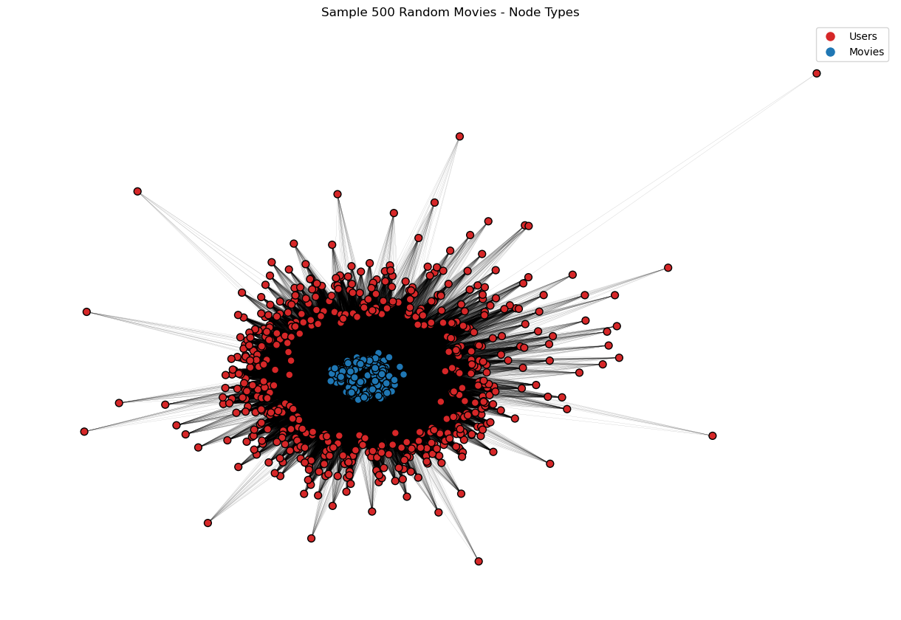
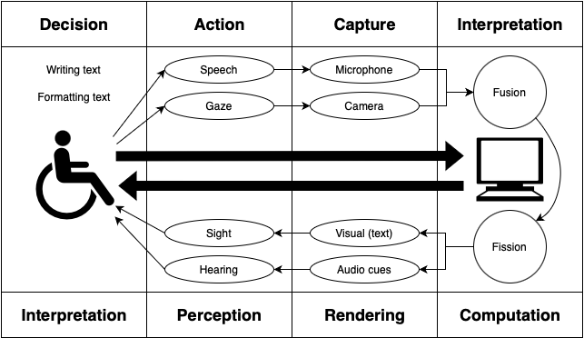

# 💼 Portfolio  

## Brain Age Prediction from Sleep Electrophysiology Using Foundation Model Principles (Master Thesis) 
**Goal:** Develop a model to predict brain age from sleep electrophysiology using a pretext and downstream task.  
📌 **Tech Used:** Python, MNE, TensorFlow, Keras, scikit-learn, Seaborn  
📌 **Outcome:** Developed and trained a well performing sleep scoring pretext task model, used features from pretext task to implement and test multiple different brain age prediction regression models with limited performance, also tried to predict cognitive status from pretext task features, visualized learning curves and model outcomes  
🔗 [View on GitHub](https://github.com/portmannh/brain-age-from-sleep)    
🔗 [PDF Report](assets/pdfs/MasterThesis_HannahPortmann.pdf)    

  

---

## Analysing Data from Wearable and Nearable Sensors  
**Goal:** Compare the performance of wearable and nearable sensors against EMG signals to assess their reliability in detecting motor activity during sleep.  
📌 **Tech Used:** Python, NumPy, Pandas, Matplotlib, Seaborn, MNE  
📌 **Outcome:** Performed cross-correlation analysis and visualized the relationship between wearable/nearable sensors and EMG signals, providing insights into sensor reliability for motor activity detection.  
🔗 [View on GitHub](https://github.com/portmannh/data-analysis-biosensors)  
🔗 [PDF Report](assets/pdfs/Comparing Wearable and Nearable Sensors Versus Polysomnography for Sleep Motor Activity Detection.pdf)  

---

## Community Detection in Bipartite Movie Networks  
**Goal:** Implemented a bipartite network analysis on Letterboxd user-movie data.  
📌 **Tech Used:** NetworkX, Python, Numpy  
📌 **Outcome:** Implemented bilouvain algorithm and visualized found communities of users and movies    
🔗 [View on GitHub](https://github.com/portmannh/SMA-Lboxd)  
🔗 [PDF Report](assets/pdfs/Community Detection in Bipartite Networks.pdf)  

  

---

## Multimodal Text Editor with Eye-Tracking  
**Goal:** Developed an editor integrating speech-to-text and eye-tracking for accessibility.  
📌 **Tech Used:** Python, Flask, OpenAI-whisper, PyAudio, HTML, CSS  
📌 **Outcome:** Created a functional prototype improving accessibility for disabled users.  
🔗 [View on GitHub](https://github.com/portmannh/SR_Gaze_TextEditor)  
🔗 [PDF Report](assets/pdfs/Building a Multimodal Text Editor MUI.pdf)  

[⬅️ Back to Home](index.md)
